# 🚀 Ventures AI - Your Intelligent Companion


[](https://flutter.dev/)
[](https://dart.dev/)
[](https://riverpod.dev/)
[](https://firebase.google.com/)
[](LICENSE)

**Ventures AI** is a modern mobile application that offers Multimodal AI models under one roof, developed adhering to **Clean Architecture** principles.

It combines text, voice, and image processing capabilities to provide users with a personalized assistant experience.

---

## ✨ Features

### 🧠 1. AI Chat Assistant (Gemini 2.0 Flash)
- Intelligent assistant capable of chatting with the user in natural language.
- Ability to guide users about in-app features.
- Customized AI personality with **System Instructions**.
- Modern, animated, and user-friendly messaging interface.

### 📄 2. Document Analysis (Gemini Vision)
- Content analysis by uploading **Images** or **PDFs**.
- Summarizing and extracting data from any document, from invoices to lecture notes.
- Viewing outputs in **Markdown** format and downloading them as **PDF Reports**.

### 🎨 3. AI Image Generation (Stability AI)
- Creating high-quality images from text prompts.
- **20+ Different Style Options:** Anime, Cyberpunk, Oil Painting, 3D Render, etc.
- Saving created images to the gallery and sharing them.

### 🗣️ 4. Text to Speech (ElevenLabs TTS)
- Converting written text into ultra-realistic human voice.
- **Dynamic Voice Selection:** Voices with different accents, genders, and intonations.
- Caching voices and offline listening.

### 💎 5. Credit & Membership System (Firebase)
- **Freemium Model:** Daily free usage rights.
- Instant credit tracking and synchronization with **Firebase Firestore**.
- Usage history tracking and cloud synchronization.

---

## 🛠️ Tech Stack

This project is developed using industry-standard architectures for scalability and testability.

| Layer | Technologies |
| --- | --- |
| **Language** | Dart 3.0+ |
| **Framework** | Flutter 3.27+ (Material 3) |
| **Architecture** | Clean Architecture (Data, Domain, Presentation) |
| **State Management** | Riverpod (StateNotifier & ConsumerWidget) |
| **Backend** | Firebase (Auth, Firestore, Crashlytics) |
| **Network** | Dio (Interceptors, Error Handling) |
| **Local Storage** | SharedPreferences (Caching) |
| **AI Models** | Google Gemini, Stability AI, ElevenLabs |
| **Navigation** | GoRouter |

---

## 📂 Project Structure

The project is separated into layers according to the Separation of Concerns (SoC) principle:

    ```bash
    lib/
    ├── common/             # Common components (Widgets, Constants, Extensions, Network)
    ├── data/               # Data layer (API calls, Models, DTOs)
    │   ├── data_source/    # Remote (API) and Local (DB) data sources
    │   ├── model/          # JSON serializable models (JsonSerializable)
    ├── domain/             # Business logic layer (Repository interfaces)
    │   └── repository/     # Repository implementations
    ├── presentation/       # UI layer (View, ViewModel/Notifier, State, Mixin)
    │   ├── auth/           # Login, Register, Splash
    │   ├── chat/           # AI Chat module
    │   ├── image/          # Image generation module
    │   ├── document/       # Document analysis module
    │   └── profile/        # Profile and Settings
    └── main.dart           # Application entry point

---

## 📸 Screenshots

Screenshots regarding the main features of the application are below:

### 1. Onboarding & Auth
| Splash Screen | Login & Register |
|:---:|:---:|
| 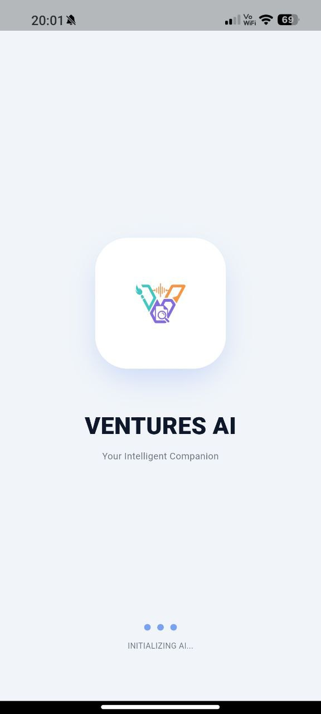 | 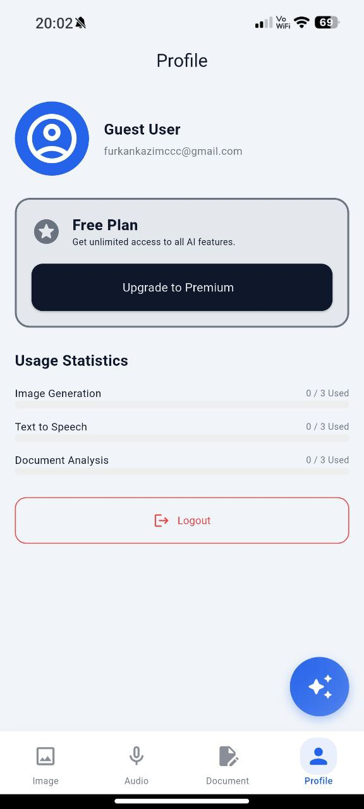 |

### 2. AI Image Generation (Stability AI)
| Style Selection | Generation Result | History |
|:---:|:---:|:---:|
| 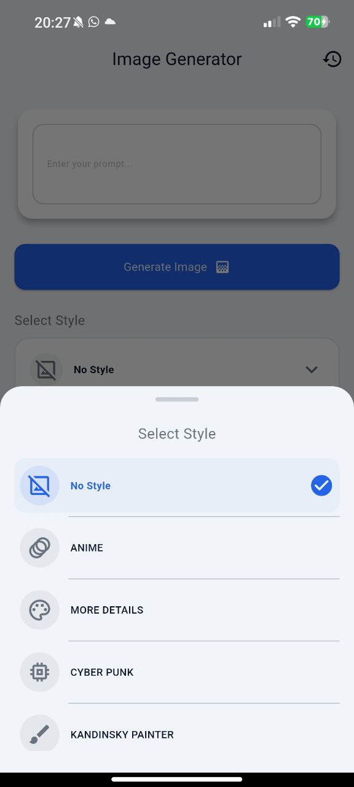 | 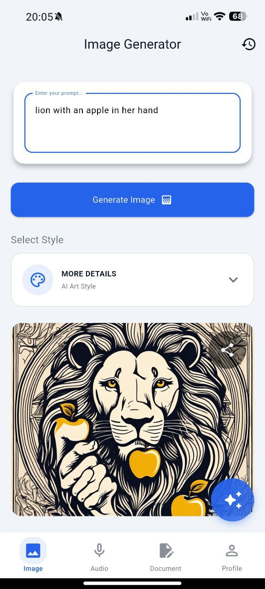 | 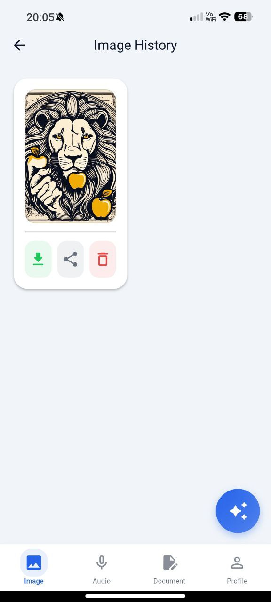 |

### 3. Document Analysis (Gemini Vision)
| Document Selection & Analysis | Analysis Result | History |
|:---:|:---:|:---:|
| 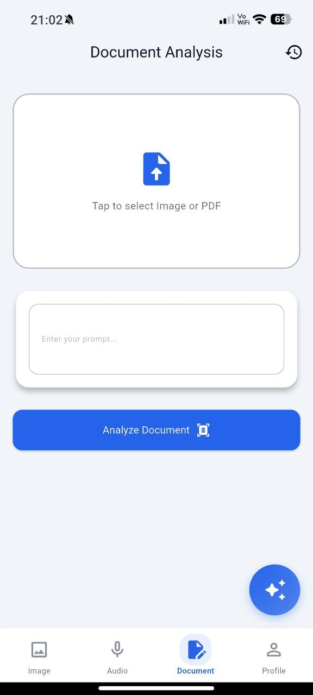 | 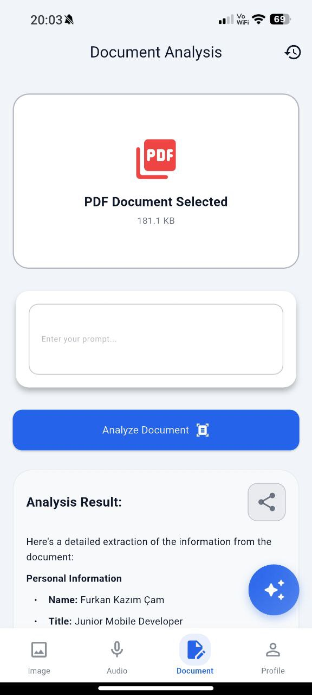 | 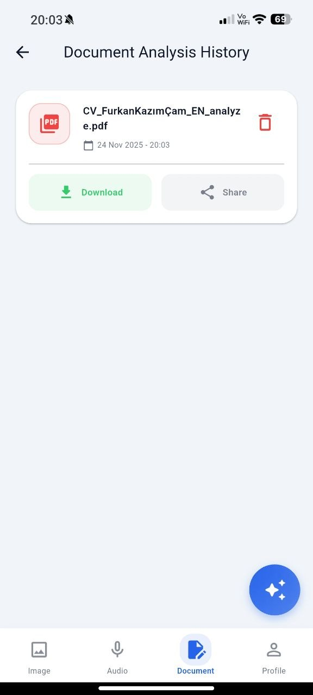 |

### 4. Text to Speech (TTS) & Image Gen
| TTS Screen | Voice Selection | Image Result |
|:---:|:---:|:---:|
| 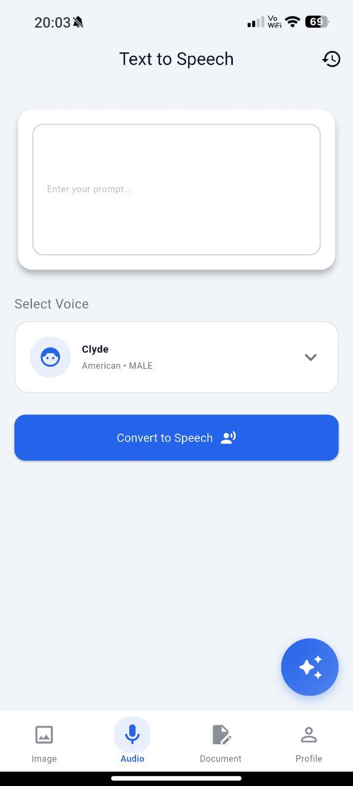 | 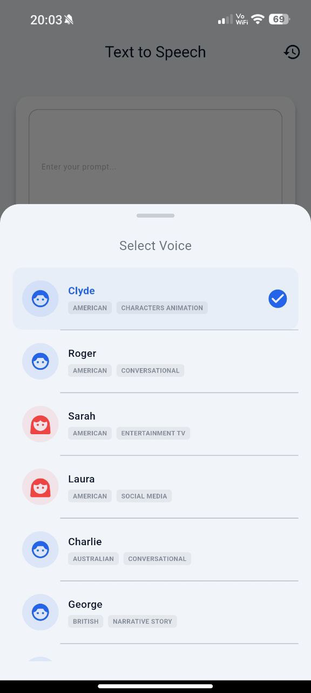 |  |

### 5. AI Chat Assistant
| Chat Interface | AI Response |
|:---:|:---:|
| 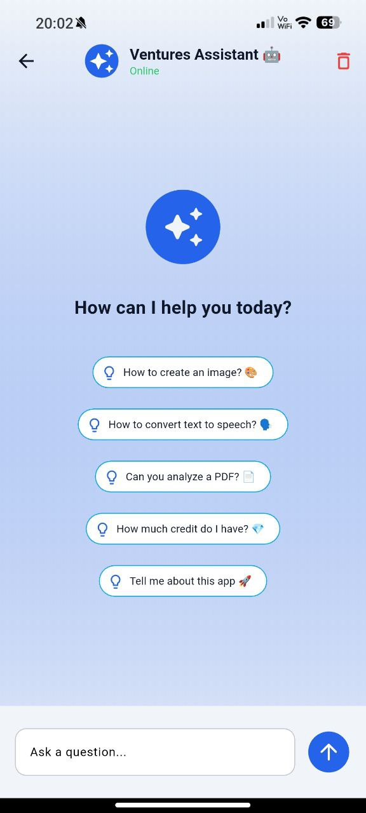 | 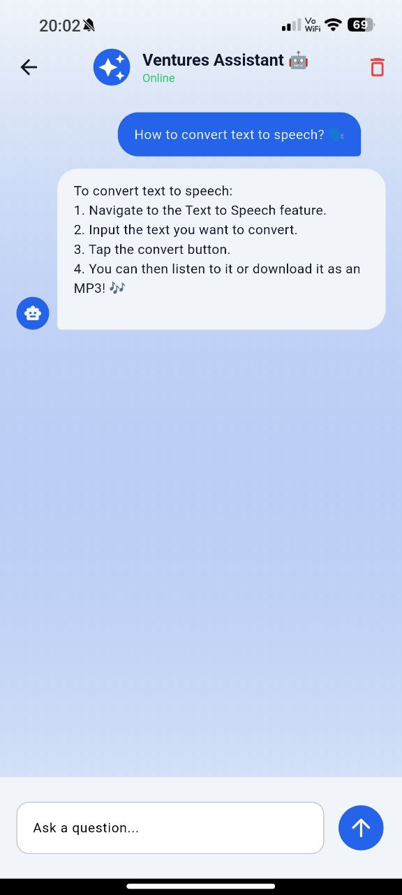 |

## 🚀 Installation

Follow the steps below to run the project in your local environment.

### 1. Clone the Repository
    ```bash
    git clone [https://github.com/Furkanncm/ventures.git](https://github.com/Furkanncm/ventures.git)
    cd ventures

---

### 2. Install Dependencies
    ```bash
    flutter pub get

---

### 3. Set Environment Variables (.env)
Create a .env file in the project root directory and add your own API keys:

    ```env
    GEMINI_API_KEY=AIzaSyD...
    STABILITY_API_KEY=sk-...
    EVENTLAB_API_KEY=xi-...

---

### 4. Firebase Configuration
Create your Firebase project and configure it using FlutterFire CLI:

    ```bash
    flutterfire configure

---

### 5. Code Generation (Build Runner)
To generate models and JSON serialization codes:

    ```bash
    flutter pub run build_runner build --delete-conflicting-outputs

---

### 6. Run

    ```bash
    flutter run

---

## 🤝 Contributing

Contributions are welcome! Please follow these steps:

1.  Fork this repository.
2.  Create a new feature branch (`git checkout -b feature/new-feature`).
3.  Commit your changes (`git commit -m 'Added new feature'`).
4.  Push to the branch (`git push origin feature/new-feature`).
5.  Create a Pull Request (PR).

---

## 📄 License

This project is licensed under the [MIT License](LICENSE).